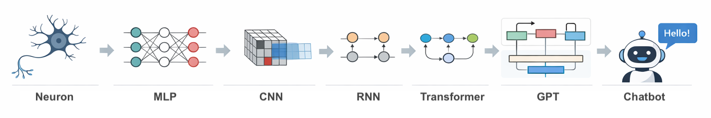

# 从人工神经元到聊天机器人

一本 **从零实现深度学习与大语言模型** 的入门教程。

本书从最基础的 **人工神经元** 开始，逐步构建完整的深度学习训练框架，并最终实现一个可以进行文本生成和对话的 **GPT 类聊天模型**。

不同于依赖 PyTorch / TensorFlow 的教程，本书 **全部使用 NumPy 从零实现**，帮助读者真正理解现代深度学习模型的内部原理。



# ✨ 本书特点

### 1. 从零实现

所有模型与算法均使用 **NumPy 实现**：

- 不依赖 PyTorch / TensorFlow
- 不依赖深度学习框架
- 所有核心算法完全透明

读者可以看到每一步计算的具体实现。

### 2. 逐步构建完整训练框架

本书不仅介绍模型，还会一步步构建一个简化版深度学习框架，包括：

- 张量（Tensor）
- 自动微分（Autodiff）
- 优化器（Optimizer）
- 数据集（Dataset）
- 模型结构（Model）

读者将从零实现一个小型深度学习框架。

### 3. 覆盖完整深度学习发展路线

从最基础模型一直到现代 **大语言模型（LLM）**：

人工神经元
→ 多层感知机 (MLP)
→ 卷积神经网络 (CNN)
→ 循环神经网络 (RNN / LSTM)
→ Transformer
→ GPT

最终实现一个可以 **生成文本的 GPT 模型**。

### 4. 所有章节均为可运行 Notebook

本书的每一章均采用 **Jupyter Notebook (`.ipynb`)** 编写：

- 每个章节都可以 **独立运行**
- 代码与解释 **紧密结合**
- 方便读者实验与修改

读者可以一步步运行代码，观察模型训练过程。

# 🎯 读者对象

本书适合以下读者：

- 想理解 **深度学习底层原理** 的学习者
- 想了解 **Transformer / GPT 工作机制** 的开发者
- 想实现 **自己的深度学习框架** 的工程师
- 希望系统学习 **LLM 基础知识** 的读者

建议读者具备以下基础：

- Python 编程基础
- 基本的线性代数知识

# 🚀 运行方式

本书所有章节均为 **Jupyter Notebook**。

安装依赖：

```bash
pip install numpy
pip install jupyter
````

启动 Notebook：

```bash
jupyter notebook
```

然后运行对应章节即可。

# 📚 学习目标

完成本书后，读者将能够：

* 理解 **深度学习模型的基本原理**
* 从零实现 **神经网络训练框架**
* 理解 **Transformer 的核心机制**
* 训练并运行一个 **简化版 GPT 模型**
* 了解 **LLM 的微调与推理方法**

# 🧠 设计理念

现代深度学习框架极大降低了使用门槛，但也隐藏了许多关键细节。

本书的目标是：

> **让读者理解每一行代码背后的数学与算法。**

通过使用最基础的 **NumPy** 实现所有算法，读者可以真正理解：

* 神经网络如何训练
* Transformer 如何工作
* GPT 如何生成文本

# 📖 电子书

[从人工神经元到聊天机器人 - 电子书](https://n2gpt.github.io/from-neuron-to-gpt/)